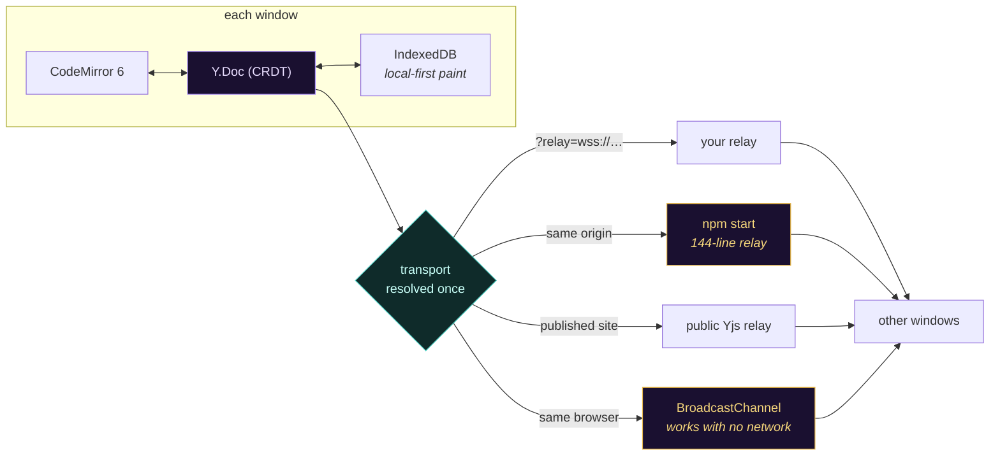
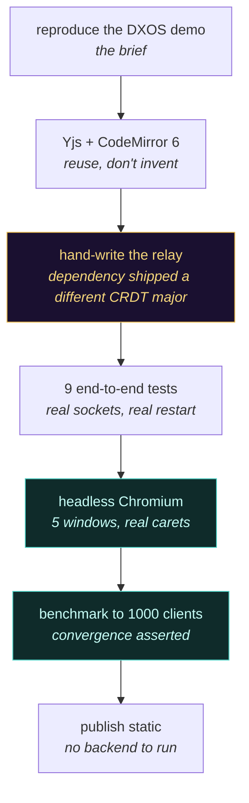

<div align="center">


[](https://github.com/fire17/EchoCollab/actions/workflows/pages.yml)
[](https://dxos.akeyo.io)
[](test/smoke.js)
[](#-measured-not-claimed)
[](#-measured-not-claimed)
[](server/sync.js)
[](LICENSE)
[](https://github.com/fire17/EchoCollab/stargazers)

*No save button. No locking. No "someone else is editing this file".*

**[⚡ Try it live](https://dxos.akeyo.io)** · **[🚀 Quickstart](#-quickstart)** · **[🧠 How it works](#-how-it-works)** · **[📊 Measured](#-measured-not-claimed)** · **[🔬 Making of](#-how-this-was-actually-built)**

</div>

---

## 🛑 The part that should stop you

**Open [dxos.akeyo.io](https://dxos.akeyo.io) in two windows and type. There is no backend of ours behind that URL.**

- The page is **static** — GitHub Pages, no server we run, no bill, nothing to keep awake.
- Two windows on one machine sync through **BroadcastChannel**, so the demo keeps working even with every network path down.
- Across machines it borrows a **public Yjs relay**; point it at your own with `?relay=wss://your-host/ws` and nothing else changes.
- Where a relay *does* run, it is **[144 lines](server/sync.js)** — and 1000 browsers in one room still land every keystroke in a **median 8.9 ms**, all converging on a byte-identical document.
- Every number on this page came out of a command in this repo. The [benchmark](bench/load.js) fails the run if the clients disagree by a single character.

> [!IMPORTANT]
> Conflict-free editing is not a hard server problem — it is a *data structure* choice. Pick a CRDT and the server stops being the thing that has to be smart, correct, or even present.

<table>
<tr>
<td width="50%"></td>
<td width="50%"></td>
</tr>
</table>

## 🚀 Quickstart

```bash
git clone https://github.com/fire17/EchoCollab && cd EchoCollab
npm install && npm start
```

Open **http://localhost:1234**, press **Open 2nd window**, put the two side by side, and type in either one.

Or skip all of it and open **[dxos.akeyo.io](https://dxos.akeyo.io)** twice.

## ✨ What it does

| | |
|---|---|
| **Live shared text** | Character-level merge. Two people can type on the same word at the same time and nobody's edit is lost. |
| **Coloured carets** | Every window gets a colour and a name; their caret, selection and label render in every other window — and [no two peers ever share a colour](src/identity.js). |
| **Presence** | Header chips for everyone in the room, pulsing while they type. Click a peer to jump to what they are working on. |
| **Shared undo** | Cmd/Ctrl+Z undoes *your* edits only — it never reaches into someone else's work. |
| **Offline tolerant** | Press **Go offline**, keep typing in both windows, come back. The edits merge; nothing conflicts, nothing is lost. |
| **Local-first load** | The last known text paints from IndexedDB before the socket opens. |
| **Honest latency** | The footer shows a real round trip, [measured over whatever transport is in use](src/pulse.js) — no special endpoint, no invented number. |
| **Rooms** | The URL hash is the room. Click the room name to switch, **Copy link** to invite. |
| **Full editor** | CodeMirror 6: markdown highlighting, line numbers, folding, search, bracket matching, multiple cursors, soft wrap. |
| **Survives restarts** | Rooms are [snapshotted to disk](server/persistence.js) and reloaded; empty rooms are evicted from memory. |

## 🧠 How it works

Edits apply to the local CRDT **first** and are broadcast after, so typing never waits on a round trip — the network only carries the merge.



Three deliberate choices, all in [`server/`](server):

- **Own the protocol** ([`server/sync.js`](server/sync.js)). The obvious dependency resolves its own Yjs major while the browser build runs another; two CRDT versions on one wire is not a risk worth saving a file.
- **No compression.** `perMessageDeflate` costs more CPU per message than it saves on a few hundred bytes of delta, and adds latency to every keystroke.
- **Drop slow clients, never buffer them.** A socket that stops draining is closed once its send buffer passes `MAX_BUFFERED`, so one stalled tab cannot grow the server's memory.

## 📊 Measured, not claimed

[`npm run bench`](bench/load.js) drives real headless clients through the real relay and reports the distribution, not an average. One MacBook runs the server **and** every client at once — a hostile setup, since the load generator competes with the thing it measures.

| clients (one room) | connect + sync | propagation p50 | p95 | p99 | max | server RSS |
|---|---|---|---|---|---|---|
| 200 | 555 ms (2.8 ms each) | **0.44 ms** | 2.6 ms | 8.7 ms | 11 ms | 169 MB |
| 1000 | 9.1 s (9.1 ms each) | **8.9 ms** | 23 ms | 130 ms | 281 ms | 224 MB |

Every run asserts all clients ended byte-identical; a fast benchmark that quietly corrupted the text would be worthless.

```bash
npm run bench -- --clients 500 --edits 300 --gap 5
```

In-app round trip on one machine reads **1.4–2 ms** (visible in the screenshots above). The client is 237 kB of gzipped JS plus 1.8 kB of CSS.

## 🔬 How this was actually built

One session, start to finish, with a browser driving the real thing at every step.



<details>
<summary><b>Five defects the process caught — each found by running it, not by reading it</b></summary>

<br>

| # | Defect | How it surfaced | Fix |
|---|---|---|---|
| 1 | Server and browser would have run **two different Yjs majors** | `npm ls yjs` after adding the obvious server dependency | Dropped it; wrote [`server/sync.js`](server/sync.js) against one pinned Yjs |
| 2 | `provider.destroy()` leaks the awareness heartbeat — **the test process never exits** | Test suite hung for 45 s and was killed | Tear down awareness first ([`test/smoke.js`](test/smoke.js)) |
| 3 | Two peers drew the **same colour** (5 windows → 3 colours) | Five-window browser run counted distinct caret colours | Higher client id yields and repicks the least-used hue ([`src/identity.js`](src/identity.js)) |
| 4 | Caret name labels **buried the line above** when peers stacked | Screenshot of four peers on consecutive lines | Labels fade after 2.4 s, return on hover ([`src/theme.js`](src/theme.js)) |
| 5 | The latency readout **re-timed already-answered pings**, reporting 144 ms where the truth was 2 ms | Median stayed far above the observed best | Sample each ping exactly once ([`src/pulse.js`](src/pulse.js)) |

Two more were found in the plan rather than the code: y-webrtc's public signalling servers are **gone** (both resolve to nothing), which killed a peer-to-peer transport before it was written; and a shared relay needs unguessable default rooms, or a stranger's link drops you into their document.

</details>

<details>
<summary><b>Relay configuration</b></summary>

<br>

| | default | |
|---|---|---|
| `PORT` / `HOST` | `1234` / `0.0.0.0` | |
| `MAX_CONNECTIONS` | `10000` | upgrades refused with 503 past this |
| `MAX_BUFFERED` | `4 MB` | send-buffer ceiling before a client is dropped |
| `MAX_PAYLOAD` | `4 MB` | largest accepted frame |
| `PING_INTERVAL` | `25000` | heartbeat that reaps half-open sockets |
| `PERSIST` | `1` | `0` disables room snapshots |
| `DATA_DIR` | `./.data` | where snapshots go |
| `PERSIST_DEBOUNCE` | `2000` | ms of quiet before a snapshot is written |

`npm run dev` runs Vite with HMR and proxies the realtime paths to the relay, so the client always talks to its own origin.

**Scaling past one process:** rooms are already independent, so shard them across processes by room name behind a hash-routing proxy — a room's clients only need to reach the same process, and no cross-process coordination is required until one room outgrows one core. A shared Redis or Postgres behind [`persistence.js`](server/persistence.js) replaces the local snapshot at that point.

</details>

## 🔒 What it touches, and how to undo it

| | |
|---|---|
| Writes on your machine | `.data/` (room snapshots) and `node_modules/`, both inside the clone |
| Writes in your browser | IndexedDB, one entry per room, for local-first paint |
| Sends anywhere | Only the document you type, to the relay in use. Presence is never persisted |
| Accounts, keys, telemetry | None |
| Uninstall | `rm -rf EchoCollab` — nothing lives outside the clone |
| Run it fully private | `npm start` and share nothing; or `PERSIST=0` to keep rooms in memory only |

> [!NOTE]
> The published site uses a **public relay it does not own**. Anything typed on `dxos.akeyo.io` without `?relay=` travels through a shared server — fine for a demo, wrong for anything private. Run your own with one command.

## ✅ How the claims are enforced

Every push runs [`npm test`](test/smoke.js) in CI before the site is allowed to deploy: a real relay on its own port, real clients, and the properties this README promises — fresh rooms seeded, concurrent same-position edits converged, presence appearing and disappearing, an offline window losing nothing, a room surviving its last client, rooms isolated from each other, and **a client recovering after the relay is SIGKILLed under it**.

If those fail, [dxos.akeyo.io](https://dxos.akeyo.io) does not update.

## ⭐ If it made you open a second window

That was the whole idea — the demo is the argument. If it landed, a star is how it finds the next person who thinks realtime collaboration needs a big backend.

[](https://star-history.com/#fire17/EchoCollab&Date)

## 🔗 Related

- [fire17/p2p](https://github.com/fire17/p2p) — zero-dependency P2P chat: one key is your whole contact surface, no coordinator server
- [Yjs](https://github.com/yjs/yjs) · [y-codemirror.next](https://github.com/yjs/y-codemirror.next) · [CodeMirror 6](https://codemirror.net/) — the shoulders this stands on

Independent reproduction of a demo idea popularised by [DXOS](https://dxos.org); not affiliated with or endorsed by the DXOS project.

MIT licensed — see [LICENSE](LICENSE).

<div align="center">
<sub><i>Built in one session, verified by running it. Every number here came out of a command in this repo.</i></sub>
</div>
